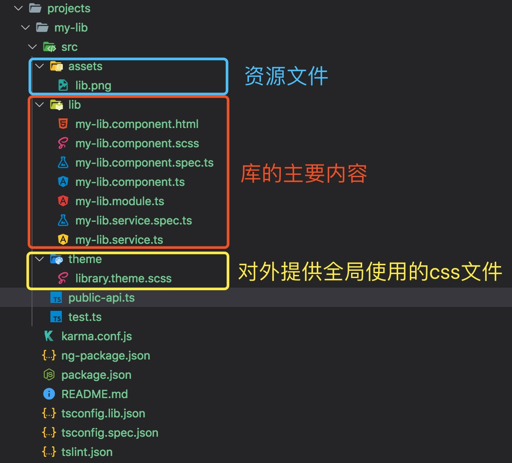
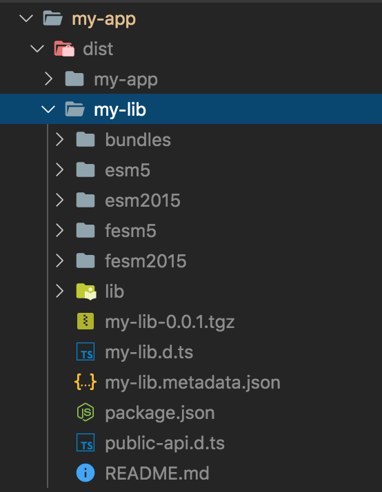
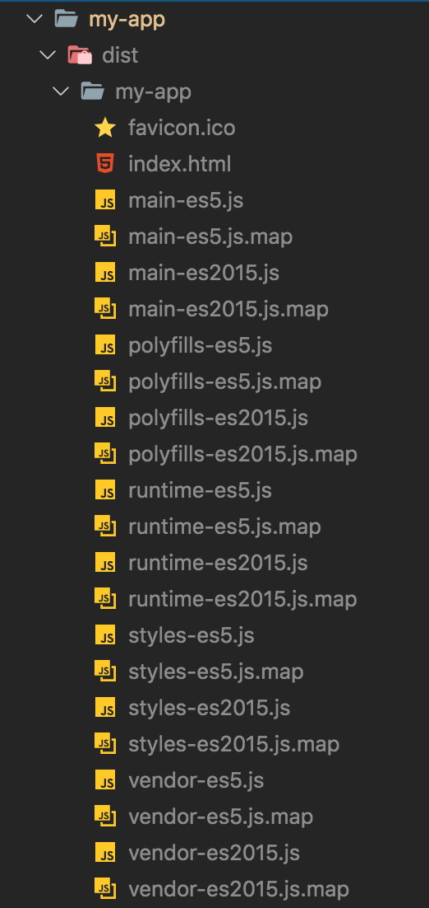

# 使用AngularCLI快速开发一个Library

**过程如下**: 

1. 使用 Angular CLI 创建 **Lib库** 的骨架
2. 开发 **Lib库**
3. 打包 **Lib库** 的资源文件和全局样式文件
4. 测试并使用 **Lib库**

**关键字说明**:

- **Lib库**: 我们要开发的**Angular Library**库
- **宿主工程**: 用来调试**Lib库**的工程, 本文中的`my-app`就是我们的**宿主工程**, `my-lib`是我们要开发的**Lib库**

---

#### 第一步: 使用 Angular CLI，用以下命令生成一个新库的骨架
`ng new my-app --skip-install --style=scss --routing=false`
`cd my-app`
`ng generate library my-lib`
`npm install`

- 此时项目的结构如下图:


#### 第二步: 开发Lib库

- **宿主工程**中的`projects/my-lib`目录下, 是我们要开发的**Lib库**
- **Lib库**的内容, 不是本文的重点, 但是为了功能的完整, 我们需要加入`assets`和`theme`两个文件夹, 其中分别放入**资源文件**和**全局样式文件**, 之后, 在`build`的时候会将它们一并打包



- 需要注意的是`ng-package.json`文件, 其中`lib.entryFile`指定**Lib库**的入口文件, 也就是`public-api.ts`文件


- 另外, **Lib库**中的`package.json`与**宿主工程**中的`package.json`没有任何关系

#### 第三步: 打包Lib库并在宿主工程中使用

- 假设你的**Lib库**的核心代码已经写好, 我们开始**打包**
- 在**宿主工程**的`package.json`的`scripts`中加入以下几个命令:

 ```js
"scripts": {
  ...
  // 1. 编译Lib库
  // 说明: my-lib是你的Lib库的名字
  // 编译的结果会放到dist/my-lib目录下(在ng-package.json文件中配置)
  "build_lib": "ng build my-lib",
  // 2. 将编译之后的Lib库打包
  // 说明: `npm pack`会将你编译之后的代码打包成.tgz文件
  "npm_pack": "cd dist/my-lib && npm pack",
  // 3. 在宿主工程中安装刚刚打包好的Lib库
  // 说明: 宿主工程作为测试用的工程, 本地安装刚打包好的Lib库即可
  "npm_install": "npm i ./dist/my-lib/my-lib-0.0.1.tgz",

  // 整合之后的命令: 最终只需要执行这一个命令即可
  // 说明: 每次Lib库有修改, 都需要重新执行这个命令
  "package": "npm run build_lib && npm run npm_pack && npm run npm_install"
  ...
}
```

- 在**宿主工程**的**根目录**下执行`npm run package`, 此时会打包**Lib库**, 并安装到**宿主工程**中

- 在**宿主工程**的`app.module.ts`中引入**Lib库**, 并在`app.component.html`中使用

- 现在在**宿主工程**中执行`ng serve -o` 启动程序, 你应该可以看到页面正常显示.
***但是*** ~~~ 引入**图片**和**全局样式** ~~~ **失败**




#### 第四步: 打包资源文件和全局样式文件

- **宿主工程**的`package.json`中的`scripts`修改如下:
```js
"scripts": {
  ...
  // 1.编译Lib库
  "build_lib": "ng build my-lib",
  // 2.将编译之后的Lib库打包
  "npm_pack": "cd dist/my-lib && npm pack",
  // 3. 在宿主工程中安装刚刚打包好的Lib库
  "npm_install": "npm i ./dist/my-lib/my-lib-0.0.1.tgz",

  // 4.copy assets
  // 说明: 将assets目录从Lib库中copy到dist/my-lib中
  "copy_assets": "cp -rf projects/my-lib/src/assets dist/my-lib/assets",
  // 5.copy theme
  // 说明: 将theme目录从Lib库中copy到dist/my-lib中
  "copy_theme": "cp -rf projects/my-lib/src/theme dist/my-lib/theme",

  // 整合之后的命令
  "package": "npm run build_lib && npm run copy_assets && npm run copy_theme && npm run npm_pack && npm run npm_install"
  ...
}
```
- 再次执行`npm run package`, **assets**和**theme**会打包到**Lib库**中
- 但是如果你在**宿主工程**中执行`ng build`, 查看**宿主工程**的`build`结果, 你会发现资源文件并没有被`build`到**宿主工程**中



- **重要的一步**: 在`angular.json`文件中增加以下内容, 让**宿主工程**可以使用**Lib库**中的资源文件和全局样式

- 重新再试一次, 是不是OK了?

#### 最后

- 示例工程代码稍后上传
- TODO: 使用`link`的形式调试**Lib库**

---

#### 参考资料
> [Angular CLI](https://www.angular.cn/guide/creating-libraries)

> [Library support in Angular CLI 6](https://www.jianshu.com/p/09ba8d35662e)

> [开发Lib库](https://blog.csdn.net/a343542102/article/details/86490056)

> [Angular CLI 不能自动打包Lib库中的资源文件](https://github.com/angular/angular-cli/issues/11071)

> [嫌copy太low, 用第三方库来打包assets](https://github.com/linnenschmidt/build-ng-packagr)

> [嫌copy太low, 用第三方库来打包scss](https://github.com/reactway/scss-bundle)

> npm报错: Unexpected end of JSON input while parsing near '...' , 执行`npm cache clean --force`
